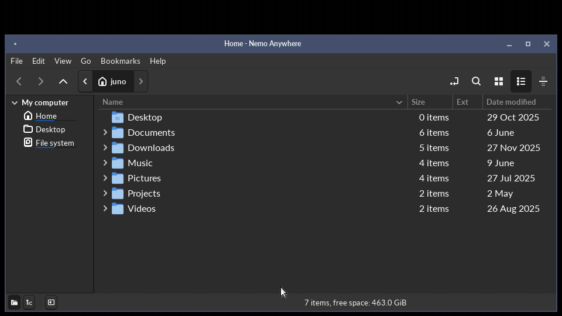

<!-- markdownlint-disable MD007 -- Unordered list indentation -->
<!-- markdownlint-disable MD010 -- No hard tabs -->
<!-- markdownlint-disable MD033 -- No inline html -->
<!-- markdownlint-disable MD055 -- Table pipe style [Expected: leading_and_trailing; Actual: leading_only; Missing trailing pipe] -->
<!-- markdownlint-disable MD041 -- First line in a file should be a top-level heading -->

<!--

-->

<!-- TOC ignore:true -->
# nemo-anywhere

<table style="border: none; border-collapse: collapse;">
	<tr style="border: none; border-collapse: collapse;">
		<td style="border: none; border-collapse: collapse;"></td>
		<td style="border: none;">This is the legendary Nemo file manager, ported to Windows, with BSD and macOS to follow - as well as to Linux without the Cinnamon dependency. It also has several major new convenience features.</td>
	</tr>
</table>

<!--  -->

<!-- TOC ignore:true -->
## Table of contents

<!-- TOC -->

- [Why](#why)
- [Existing features](#existing-features)
- [What this fork adds or improves](#what-this-fork-adds-or-improves)
- [Status](#status)
- [Icon themes](#icon-themes)
	- [Add your own theme](#add-your-own-theme)
- [Installation](#installation)
	- [Packages and installers](#packages-and-installers)
	- [Direct stable and dev install scripts](#direct-stable-and-dev-install-scripts)
	- [DIY](#diy)
- [Set up development environment](#set-up-development-environment)
- [Longer-term roadmap](#longer-term-roadmap)
- [Copyright and license](#copyright-and-license)

<!-- /TOC -->

## Why

Nemo is one of the best file managers going. It's fast, sane and powerful.

Unfortunately, it's tightly integrated into the Linux Cinnamon desktop.

This project removes the Cinnamon (and even Linux) dependency:

- It takes Nemo as-is, from the source.

- It removes every assumption that says "you depend on Cinnamon", "you're managing the desktop", or even "you are running on Linux".

- It removes the heavy desktop integration. Your existing manager is untouched. (Which can even be the original Nemo, since they don't conflict.)

- It's shippable everywhere, or at least to every desktop OS.

That means, in order:

- **Linux**:

	- It runs standalone on any desktop.

	- It has no big stack of Cinnamon dependencies. (But run on the Cinnamon desktop just fine.)

	- It doesn't try to compete with existing desktop managers for control of desktop rendering.

- **Windows**: It's a real native build, not a compatibility shim.

- **BSD**: Coming soon.

- **macOS**: App store process underway.

There is one codebase. "For Windows" and friends are just labels on builds, not separate projects.

It is opinionated. It manages files and folders. It does more of the file management you need, built in, on every platform, so nothing depends on third-party programs, plugins or extensions that only exist on one of them.

This is an independent, unofficial hard fork of [linuxmint/nemo](https://github.com/linuxmint/nemo), taken at the 6.6.4 release. It is not affiliated with, endorsed by, or supported by Linux Mint, the Cinnamon team, or GNOME.

Report issues here, never upstream. Provenance details live in [fork.md](fork.md).

## Existing features

These are the features that make Nemo worth porting:

- Navigation is fast and no-nonsense. Back, forward, up and refresh are there, with breadcrumbs or a path box, whichever you pick.

- File operations show real progress. You can see what is happening, and how far along it is.

- Folder contents merging is intuitive. No more accidental clobbering.

- Open in terminal is built in.

- It has proper bookmarks.

- Copies use near-instant and near-zero-size CoW copies automatically, if the underlying filesystem allows it.

## What this fork adds or improves

- **Cinnamon Desktop is not required**.

- **Linux is not required**. Windows is a real native build, not a compatibility layer. (BSD coming soon.) You can install it from here, and Windows Store and Apple Store downloads are underway.

- On Windows it is one executable. The whole runtime is packed inside it, so there is nothing to install and nothing to keep in step. Copy it where you like and run it.

	- It's the same idea as an AppImage or a Flatpak, without the runtime or the sandbox.

	- On Linux it stays a small folder that uses the GTK3 your distro already has, because that is what a Linux user expects and it keeps the download tiny.

- Windows features:

	- A conscious decision was made to avoid Explorer integration at any cost, since we can't let an Explorer crash bring Nemo Anywhere down with it. Nemo Anywhere only links to shell32.dll in its own process space, which provides most native Windows functionality.

	- The native Windows Recycle Bin can be browsed, restored from, and emptied.

	- Alt+Enter opens the same Properties sheet Explorer shows, tabs from other programs included.

	- `.lnk` shortcuts can be made, edited and opened the same way Explorer does. Shortcuts, symlinks and junctions each get their own overlay, so they are easy to tell apart. (You can make hardlinks too.)

	- Each fixed drive sits in the sidebar with a usage bar.

	- Dot files and files with the hidden attribute each have a switch. Ctrl+H flips both. (They can also be independently hidden.)

	- Includes right-click options like "Open in Windows Terminal", "Open as Administrator", "Open with Explorer", and "Copy path" with either kind of slash.

	- Light or dark follows the Windows setting. Four icon sets are drawn to match XP, 7, 10 and 11.

	- Per-monitor DPI-aware.

	- File associations are read from the registry and never written to it. "Set as default" keeps its choice in the settings file.

- Every instance gets its own process. If one crashes for some reason, the rest keep going.

	- A crash writes a report beside the settings file.

- Archive handling is integrated, and more advanced. No more third-party GUI application dependencies that don't feel integrated, and don't support the archive format's best options.

	- Create and extract zip, tar and 7z natively. Features like split volumes, 7z passwords, and all rar features are automatically enabled if the native 7z and/or rar CLI programs are installed.

	- Right-click Extract reads most archive types, with real progress and a question when a file already exists. An archive can't write outside the folder it is unpacked into.

	- Compress can delete the original contents afterward (off by default). It reads the finished archive back first and checks every file and size; only then sends the originals to the trash.

- Comprehensive link creation options:

	- "Make link" asks what to make: a symlink, a hardlink, or a Windows shortcut.

	- Reading and creating Windows `.lnk` shortcuts work on Linux and macOS too. (But unfortunately, on those platforms, the Windows shortcut format only works in Nemo Anywhere.) The nuances of behavioral differences between symlinks and shortcuts work on Linux and macOS just as they do on Windows.

	- On Windows, directory junctions are also offered as a (generally superior) option.

	- For symlinks, you can choose relative or absolute path.

		- Note: Shortcuts, by Microsoft definition, handily contain both relative and absolute paths by definition, plus a portable path such as `%USERPROFILE%\Documents`. This helps the shortcut format overcome the limitations of relative vs absolute symbolic links.

- Windows environment variables and backslashes work on Linux and macOS. Linux and macOS variables and forward slashes work on Windows.

- The thumbnail-caching engine has been modernized:

	- A folder of pictures has all its thumbnails generated as soon as it opens - top down, to minimize I/O contention and maximize total speed.

	- It no longer gets confused by showing the wrong thumbnail for renamed files that have the same filename and size but different content.

	- Photoshop, HEIC, and most camera raw files get thumbnails too. If ImageMagick is installed, thumbnails also work for JPEG 2000, EXR, and a few dozen more.

	- The thumbnail cache is cleaned up once in a while in the background, rather than growing forever.

	- Image thumbnails get their own (larger) thumbnail size, and folders with mostly images auto-switch to large thumbnail view (which can be disabled), while regular folders maintain their normal view.

- List view columns sizing is no longer a mess. They intelligently size themselves by priority to what is in them, and the space given. A scrollbar appears before columns get squeezed too narrow to read.

- There's a handy new "extension" column, in addition to "file type".

- Moves and deletes are safer:

	- A drag that moves files, alerts you to what it's about to do first. (One of the easiest ways to lose track of a file in any graphical file manager is an accidental drag to some folder you didn't see it drop in. A copy goes through without a word unless you opt-in to that check also. A dropped link opens a "Make link" dialog, so you can pick what kind (or cancel).

	- A large delete, or one generated with no user input, prompts even with confirmation turned off.

	- Trash and delete operations record what they did: how many items, which folder, the first name in the batch, and what set it off.

	- Links are never followed on a delete or move. Only the link itself goes. Copying a link asks whether to keep it as a link, or copy what it points to.

	- Only a window can trash, delete or move files. Another program on the session bus can't (which Nemo's old desktop interface allowed).

- Alternate rows can be shaded, off by default. Selection and hover still show through it.

- Places and the folder tree can now both open at the same time. The tree lists folders only, and a folder with nothing under it gets no expander.

- Tabs are as wide as their title. With full paths on, a path too long to fit is shortened a step at a time, and the name of the folder itself is always kept. The active tab shows as much of the path as possible.

- Every folder follows one set of view defaults, unless per-folder settings are turned on.

- Window size and zoom are remembered for each monitor, by its resolution and DPI. A window dragged to another monitor takes the size and zoom last used there. (Coming soon.)

- Search has several improvements:

	- Search results can be grouped under the folder they came from. A flat list of thirty files all called `notes.txt` tells you nothing; a row per folder with the matches under it tells you where to look. It's one toggle in the search bar, and the results are the same either way.

	- Search results keep the columns you pick, the order you drag them into, and how they are sorted. By default they show Name, Ext, Size, Date modified and Location.

	- Content search reads Word, Excel, PowerPoint, OpenDocument, and EPUB files by itself. It needs no helper scripts and no office suite.

	- On Windows, the search index can be used for faster searches. It is off by default, since it only knows the folders it was told to watch.

- Settings live in one plain text file you can read and edit. There's no registry, no dconf and no compiled schema. Editing it by hand does the same thing as changing the setting in the dialog.

- Copy, paste and drag work with the platform's own file manager, in both directions.

- Features that a platform can't do is either hidden or visually disabled.

- Releases can be checked. Every download is published with checksums, and the Linux builds can be rebuilt from their commit to the same bytes. That starts with the release after 1.0.0-beta2.

- There are dozens of "minor papercut" fixes and "quality-of-life" improvements.

## Status

Currently beta - for options tuning and visual polish. But the guts and stability are safe, solid, and ready for safe everyday use.

Every build goes through static analysis, the full regression suite, and the exhaustive checks that guard against losing files. A full pipeline run adds fuzzing and a performance profile.

Current limitations:

- For now, every trash and delete asks first with a detailed dialog noting exactly what is about to go, where, and why - which is wired into all possible trash/delete/move code paths. It is an extra safety net for all prereleases whether needed or not.

	- It can be safely turned off in Preferences.

- The Windows exe is not code-signed yet, so Windows may warn the first time it runs.

- If you use MacType on Windows, add the portable exe's file name to MacType's exclusion list (the `[UnloadDll]` section of its profile). With MacType loaded into it, the portable exe can't start the helper programs packed inside it, so office files get no thumbnails and each one shows a "Cannot load library" box until it times out. An installed copy, from the setup exe or the install script, is not packed and isn't affected.

- Settings from a pre-1.0 install do not carry over.

- macOS and BSD are not built yet.

Details are in these docs:

- The development backlog: [project/backlog.md](project/backlog.md).

- Design: [project/design.md](project/design.md).

- Code style: [project/style-guide_code.md](project/style-guide_code.md).

- UX style guide: [project/style-guide_ux.md](project/style-guide_ux.md).

## Icon themes

24 icon sets, light and dark, are built into the Windows build, so there's nothing to download. Linux and BSD builds use the icon themes the desktop already has. Pick one in **Preferences -> Appearance**; the Style picker moves the Icons picker to match, so a Windows 11 window frame does not come with macOS icons unless you ask for it.

Each set is shown twice, on a light background and a dark one, because half of them are drawn for a dark desktop. The four Windows looks - XP, 7, 10 and 11 - are drawn in-house: no cleanly-licensed set of any of them exists, and every set that circulates draws blue folders, which Windows has never had. The rest are trimmed to the roughly 180 names a file manager actually asks for, which is what holds a set to a few hundred kilobytes; anything not drawn falls through to Adwaita.

Provenance and license for every vendored set is in [vendor/README.md](vendor/README.md).

### Add your own theme

On Linux and BSD, Nemo Anywhere inherits whatever widget and icon theme is set at the desktop level (as one would expect).

But on Windows, you can drop a theme folder into the icons directory beside your settings file, and it appears in the picker on the next launch - `~/.config/nemo-anywhere/icons/` on Linux and BSD, `%APPDATA%\nemo-anywhere\icons\` on Windows, `~/Library/Application Support/nemo-anywhere/icons/` on macOS. Widget themes work the same way in `themes/` beside it. Both folders are created empty on first run.

[filesystem/README.md](filesystem/README.md) covers the layout, the two optional `index.theme` keys that tell the picker which modes a theme suits, and one-line fetch commands for Buuf - a set worth having that cannot be bundled, because its NonCommercial license rules it out of anything distributed.

## Installation

Everything is on the [releases page](https://github.com/yottacore/nemo-anywhere/releases). Pick whichever of the three below suits you. Building from source is for working on it, not for using it.

### Packages and installers

- **Windows**: run `nemo-anywhere-<version>-windows-x86_64-setup.exe`. It installs for your account only and needs no admin rights. It uses the same folder, Start menu entry and PATH entry as the PowerShell script below, so either one can update or remove what the other put there. To remove it, use Settings -> Apps. It isn't signed yet, so SmartScreen will probably ask before it runs. Releases after 1.0.0-beta2 have it.

- **Windows, portable**: download `nemo-anywhere-<version>-windows-x86_64-portable.exe` and run it. That is the whole program - the runtime is inside it. Nothing is installed and nothing is registered. Releases up to 1.0.0-beta2 name it plain `nemo-anywhere.exe`.

- **Debian, Ubuntu, Mint**: Run `sudo apt install ./nemo-anywhere-<version>-linux-x86_64.deb`.

- **Fedora, openSUSE, RHEL**: Run `sudo dnf install ./nemo-anywhere-<version>-linux-x86_64.rpm`.

Both packages install to `/opt/nemo-anywhere` with a menu entry and `nemo-anywhere` on PATH, and use the GTK3 your distro already provides.

### Direct stable and dev install scripts

It's one command. It downloads the right build for the machine, verifies its checksum, tells you exactly what it is about to do, and waits for a yes. The defaults suit most people. Add `--help` (`-Help` in PowerShell) to see the options.

This one is for Linux and WSL, and for BSD and macOS once those are built:

~~~bash
bash <(curl -fsSL https://raw.githubusercontent.com/yottacore/nemo-anywhere/main/install.bash)
~~~

This one is for Windows, or anywhere else with PowerShell. It is a full installer on its own, not a wrapper around the one above:

~~~powershell
& ([scriptblock]::Create((irm 'https://raw.githubusercontent.com/yottacore/nemo-anywhere/main/install.ps1')))
~~~

A release with no checksums file is not installed, even with `--yes`. Add `--no-verify` (`-NoVerify` in PowerShell) to install it anyway.

Reinstalling over an existing copy is fine - it replaces it. `--help` also says how to remove it.

This is where it goes:

| OS      | User install (default)                 | Launcher                                                                            | (or) System install             | Launcher
| :---    | :---                                   | :---                                                                                | :---                            | :---
| Linux   | ~/.local/share/nemo-anywhere/          | ~/.local/share/applications/nemo-anywhere.desktop, ~/.local/bin/nemo-anywhere       | /opt/nemo-anywhere/             | /usr/local/share/applications/nemo-anywhere.desktop, /usr/local/bin/nemo-anywhere
| Windows | %LOCALAPPDATA%\Programs\Nemo Anywhere\ | %APPDATA%\Microsoft\Windows\Start Menu\Programs\Nemo Anywhere.lnk, and a PATH entry | C:\Program Files\Nemo Anywhere\ | %ProgramData%\Microsoft\Windows\Start Menu\Programs\Nemo Anywhere.lnk, and a PATH entry
| BSD     | *pending a BSD build*                  |                                                                                     |                                 |
| macOS   | *pending a macOS build*                |                                                                                     |                                 |

Settings go in per-platform standard locations: `~/.config/nemo-anywhere` on Linux and BSD, `%APPDATA%\nemo-anywhere` on Windows, `~/Library/Application Support/nemo-anywhere` on macOS - and are left alone by an uninstall.

### DIY

Extract `nemo-anywhere-<version>-linux-x86_64.tar.gz` wherever you like and run `bin/nemo-anywhere` from inside it. It is relocatable, so no fixed path is required. Verify the download against the `nemo-anywhere-<version>-sha256sums.txt` file published beside it.

A Linux build needs GTK 3.24.33 or newer and glibc 2.35 or newer at runtime, which means Ubuntu 22.04, Debian 12, Mint 21, Fedora 36 or anything more recent.

## Set up development environment

The reference Linux build happens in a container, so no development packages are installed on your own machine and the dependency versions are pinned to something known good.

You need Docker (or Podman with a Docker alias) and git. Everything else is fetched by the build. The first run builds the container image, which takes a few minutes, and later runs reuse it.

~~~bash
git clone https://github.com/yottacore/nemo-anywhere.git
cd nemo-anywhere
cicd/hooks/install.bash          # merge gate as a pre-push hook
cicd/cicd.bash --gate            # build, test and lint
~~~

`--gate` is the quick check. A bare `cicd/cicd.bash` runs the whole pipeline, which ends by committing and pushing, so leave that one until you mean it.

To build without the container, on a Linux box with the GTK3 development stack:

~~~bash
meson setup build source && ninja -C build
~~~

On Windows the build is native, not cross-compiled. You need [MSYS2](https://www.msys2.org/) with the mingw64 GTK3 toolchain, and [Enigma Virtual Box](https://enigmaprotector.com/en/aboutvb.html) if you want the single-exe artifact - without it the pipeline still builds and tests, it just skips packing.

~~~powershell
pacman -S --needed mingw-w64-x86_64-{gcc,meson,ninja,pkgconf,gtk3,json-glib,libarchive,libexif,libgsf,cppcheck,gettext} intltool git
pwsh cicd/cicd-win.ps1 -Gate     # lint, build and test
~~~

The full picture, meaning the exact package list, the Windows cross-compile, the release lanes and the pipeline stages, is in [project/design.md](project/design.md). How to send a change is in [contributing.md](contributing.md), and how the code is written is in [project/style-guide_code.md](project/style-guide_code.md).

## Longer-term roadmap

For maximum cross-platform portability, Nemo Anywhere needs to move off of not just GTK+ v3, but GTK+ period. While GTK+ v3 works and looks nice, it's no longer actively developed, is basically stuck with C, and is not as reliable on Windows and macOS as, say, Qt. That's what the sister project [Captain Nemo](https://github.com/t00mietum/captain-nemo) is for, once this project reaches a few stable rounds.

## Copyright and license

The [original Nemo](https://github.com/linuxmint/nemo) is the work of the Linux Mint project and [many contributors](https://github.com/linuxmint/nemo/graphs/contributors), and is itself a hard fork from 2012 of [GNOME Files aka Nautilus](https://github.com/GNOME/nautilus).

This repository, although also a hard fork, retains all original copyright and license notices; see `license.txt` (originally 'COPYING'), `license-lib.txt` (originally 'COPYING.LIB'), `license-docs.txt` (originally 'COPYING-DOCS'), and `license-for-extensions.txt` (originally 'COPYING.EXTENSIONS').

The sound files the demo recorder mixes into its video are third-party, under their own terms, and are not part of the application. Sources and licenses are in `cicd/utility/demo-video/sounds/LICENSES.txt`.

> Copyright © 2026 t00mietum (CryptogID: ปʬϝღถɔ4რఠΔթะ9ƾǝu) 
> Upstream code Copyrights © [Nemo authors](https://github.com/linuxmint/nemo/graphs/contributors). 
> Licensed under [GNU GPL v2](https://opensource.org/license/GPL-2.0) license. No warranty.
